# Controlled Dealer Data Intake Architecture

- **Status:** PLANNED architecture foundation; runtime intake is not implemented
- **Decision:** [ADR-007](decisions/ADR-007-controlled-dealer-data-intake-boundary.md)
- **Contract:** [AV-R1-CDF-001](../../contracts/r1-controlled-dealer-file-contract.md)
- **Feature linkage:** `SP-F004` capability disclosure; `SP-F020` controlled intake foundation
- **Governance:** Data capability **AMBER**; gross-profit attribution **AMBER**; DMS/provider readiness **RESEARCH REQUIRED**

## Boundary

```mermaid
flowchart LR
    Source[Authorized external source] --> Adapter[Intake adapter]
    Adapter --> Envelope[Canonical staging / source envelope]
    Envelope --> Mapping[Mapping and validation]
    Mapping --> Capability[Capability assessment]
    Capability --> Canonical[Validated canonical detection input]
    Canonical --> Detection[Service Profit detection]
    Detection --> Opportunity[Opportunity persistence]
```

The adapter boundary is delivery-mechanism neutral. A controlled file is the
first planned adapter; REST/API, SFTP/batch, and provider-specific adapters are
future options that must emit the same envelope and canonical semantics. The
existing synthetic loader remains a demo-profile capability and is not a
production ingestion service.

## Dataset and Records

The envelope and versioned field contract are authoritative in
[`AV-R1-CDF-001`](../../contracts/r1-controlled-dealer-file-contract.md). It
defines required, optional, system-generated, nullable, identity, relationship,
validation, sensitivity, and capability effects for organization, customer,
vehicle, service transaction, service job/line, recommendation, disposition,
advisor/notes, service history, invoice, invoice line, and cost.

The envelope requires dataset identity/version, contained tenant/dealer and
optional location, source lineage, schema and mapping versions, receipt time,
effective window, `FULL`/`DELTA` delivery type, reconciled record counts,
verified checksum metadata, and a processing correlation ID. It contains no
credentials or secrets. `tenantId`, receipt, counts, integrity metadata, and
correlation ID are system-controlled; source identity and effective business
dates remain lineage facts.

## Validation and Readiness

Validation is staged and auditable:

1. envelope validation;
2. schema validation;
3. type and format validation;
4. referential integrity;
5. tenant/dealer/location containment;
6. business semantic validation;
7. capability/readiness evaluation;
8. materialization eligibility.

Findings use `FATAL`, `ERROR`, `WARNING`, and `INFO`. Fatal findings reject a
dataset. Errors quarantine affected records or reject the dataset when
containment/integrity is unsafe. Warnings permit safe materialization only with
an explicit capability reduction. Info findings permit materialization and are
retained in audit evidence.

There is no single readiness score controlling all behavior. The capability
report separately describes identity/linkage, opportunity detection,
recommendation evidence, disposition, invoice/revenue attribution,
cost/gross-profit attribution, mileage policy, and contactability as
`AVAILABLE`, `PARTIAL`, `UNAVAILABLE`, or `REVIEW_REQUIRED`. Materialization
requires no fatal finding, no unresolved containment failure, and a report.

## Missing Data and Quarantine

Missing disposition is unknown, never confirmed `DECLINED`. Missing cost may
leave opportunity/revenue analysis available but makes gross-profit attribution
partial or unavailable; margin is never inferred. Missing invoice may leave
detection available but removes recovered-revenue/conversion attribution.
Missing phone/email does not invalidate detection, and presence does not imply
consent. Missing mileage degrades mileage-dependent policies while supported
date-based policies may remain. Missing or ambiguous customer/vehicle identity
quarantines the affected record for review; identity is never guessed.

Quarantine retains the original source lineage, record identity, finding codes,
severity, correlation ID, mapping version, and operator/audit actions. It is
tenant-contained, access-controlled, redacted in logs, and excluded from
opportunity materialization until an approved correction or review outcome.

## Identity, Replay, and Lineage

Dataset identity is `(tenantId, dealerId, datasetId, datasetVersion,
mappingVersion)`. Delivery identity additionally includes the verified content
digest. Record identity is `(datasetId, recordType, sourceRecordId)`, with a
stable source business key retained where available. An unchanged duplicate is
an idempotent no-op. Corrections use a new version and preserve predecessor
lineage. Mapping changes create a new assessment/materialization lineage.
Detection materialization must key opportunities to canonical source evidence
so replay cannot duplicate an unchanged opportunity.

R1 supports `FULL` snapshots only. `DELTA` is reserved for a later contract
that defines upserts, tombstones, ordering, replay windows, and reconciliation.

## First-Partner Operating Model

The recommended first-partner process is:

`Dealer export` -> `secure controlled transfer` -> `authorized AutoVision operator`
-> `intake validation` -> `mapping` -> `capability report` -> `dealer mapping
confirmation` -> `controlled materialization` -> `manager demo/pilot`.

No self-service upload UI, SFTP implementation, or API implementation is
required for the first partner. The open data questions and evidence gate are
recorded in [RS-006](../product/research/RS-006-first-partner-data-intake-questions.md).

## Security and Privacy Boundary

The future implementation must enforce server-authoritative tenant isolation,
organization containment, least privilege, authorized source/operator checks,
data minimization, PII classification, checksum verification, safe errors,
quarantine controls, retention/deletion, and auditability. Phone, email, and
note bodies must not be used in analytics or logging. Legal/privacy contractual
review is required before partner data intake; no legal compliance certification
is claimed here.

## G6.1-G6.6 Phasing

| Slice | IN | OUT | Acceptance gate |
| --- | --- | --- | --- |
| **G6.1** | Architecture, envelope, R1 canonical contract, safety semantics, governance linkage, partner questions | Runtime code, migration, adapter, ingestion | ADR and contract reviewed; invariants, links, IDs, and contract-only boundary validated |
| **G6.2** | Tenant-contained staging, source lineage, quarantine and intake persistence foundation | File parsing, provider logic, materialization | Persistence design reviewed; containment, audit, retention, replay keys and failure tests pass |
| **G6.3** | Controlled `FULL` file adapter, checksum, schema/type/reference validation | `DELTA`, self-service upload, provider-specific support | Authorized test files produce reconciled findings and quarantine/materialization eligibility |
| **G6.4** | Versioned mapping, capability report, canonical detection-input materialization | Workflow disposition and outreach | Capability-specific report and safe missing-data policies pass against approved fixtures |
| **G6.5** | Operational evidence, reconciliation, replay/correction reporting, runbook | Broad provider coverage | Operators can explain lineage, duplicates, corrections, quarantine, and deletion evidence |
| **G6.6** | First-partner validation, mapping confirmation, pilot hardening and research update | Production-readiness claim without evidence | Dealer confirms mapping; pilot evidence supports an explicit next decision |

All slices remain subject to security/privacy review and must not convert
synthetic demo coverage into production evidence.

## Explicit Exclusions

`SP-F016-A` remains **DEFERRED / Unassigned**. Source disposition from a
dealer/DMS is input evidence and is distinct from a future AutoVision workflow
disposition. Search and `UX-POLISH-01` through `UX-POLISH-04` remain deferred;
this foundation does not modify the frontend.