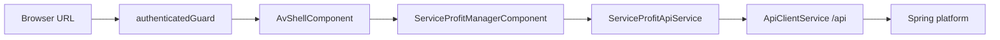
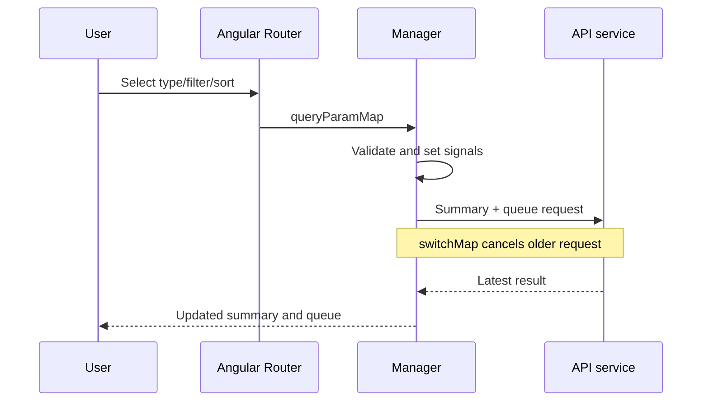

# Service Profit Frontend Flow

## Route Structure

`/service-profit` is a lazy standalone Angular route protected by `authenticatedGuard`. The route renders `ServiceProfitManagerComponent` inside `AvShellComponent`.

Planned for C2-C: `/service-profit/opportunities/:opportunityId` will provide dedicated mobile detail. It is not implemented in C2-A.



## Component Responsibilities

`AvShellComponent` owns global navigation and the authenticated-user popup. It closes the popup on outside click, Escape, Sign out, and route navigation. Escape restores focus to the trigger.

`ServiceProfitManagerComponent` owns manager query state, summary and queue loading, selection state, responsive presentation, and display-oriented domain labels. It does not authorize requests or calculate authoritative opportunity counts.

`ServiceProfitOpportunityControlsComponent` presents opportunity-type navigation, Priority and Actionability filters, Sort, refresh state, and refresh feedback. It emits explicit user intents to the manager and does not own URL or API state.

`ServiceProfitApiService` translates typed filters, pagination, and sort values into `/api/v1/service-profit/opportunities` requests. It also loads summary and detail endpoints.

`AvStatusComponent` displays compact status labels. `AvFeedbackComponent` displays empty and error feedback.

## API Interaction

The manager calls:

- `GET /api/v1/service-profit/opportunities/summary` for KPIs and authoritative category counts;
- `GET /api/v1/service-profit/opportunities?page=0&size=25&sort=...` for the queue;
- `GET /api/v1/service-profit/opportunities/{id}` for authoritative detail.

Summary and queue requests run together. RxJS `switchMap` cancels an older request when a newer URL state or refresh command arrives. Detail requests also use `switchMap`, preventing an older selection response from replacing a newer one.

No client-side sorting or count calculation is performed on the 25 loaded queue rows.

## Filter And Sort State

The URL is the source of interaction state:

| Query parameter | Domain value | Fallback |
| --- | --- | --- |
| `type` | existing opportunity types | All |
| `priority` | `HIGH`, `MEDIUM`, `LOW` | All |
| `actionability` | existing actionability values | All |
| `sort` | detected/potential ascending or descending | `DETECTED_DESC` |

Unknown values are ignored by explicit allow-list parsing. Controls navigate with merged query parameters, so browser refresh, Back, and Forward are predictable. No tenant, customer, vehicle, or other sensitive identifiers are added by these controls.



## Selection State

Current: selecting an opportunity title stores its ID, loads detail, marks the row selected, and renders the detail panel after the queue. Suppression, review-required state, context, explanation, evidence, and provenance remain sourced from the detail response.

Planned for C2-B: desktop/tablet detail immediately under or adjacent to the selected row.

Planned for C2-C: mobile cards navigate to a dedicated full-detail route and preserve list query state for browser Back.

## Authentication Boundary

The frontend guard protects navigation for user experience. The shared auth interceptor supplies browser credentials to same-origin `/api` requests. Spring authorization and tenant isolation remain authoritative. Service Profit components must not infer tenant scope or bypass the shared API client.

## Responsive Behavior

CSS owns presentation; there is no runtime viewport service.

- `<=720px`: type navigation scrolls horizontally and toolbar controls wrap compactly.
- `721px–1100px`: compact/tablet layout.
- `>1100px`: desktop layout.

Current: the opportunity table remains at all sizes and can scroll horizontally. Planned C2-C replaces it with mobile decision cards and consolidates mobile Sort/Filter controls.

## Loading And Errors

Initial and query-driven loads show the manager loading state. A failed initial/query load shows the manager error and Retry action.

Background refresh keeps loaded content visible, marks the queue busy, disables Refresh, and reports refresh failure without discarding data.

Detail loading and errors remain independent. A detail `401` displays the existing session-renewal guidance.

## Accessibility Architecture

- Native buttons and selects provide keyboard behavior.
- Type navigation is a labelled group of single-select buttons using `aria-pressed`.
- Labels wrap their associated select controls.
- The queue exposes `aria-busy`; loading uses polite live status.
- Selected opportunity text and safety notices prevent color-only communication.
- The profile popup exposes `aria-expanded`, closes globally on Escape, and restores trigger focus.
- Native `<details>` provides keyboard-accessible audit disclosure.

## Important Deferred Items

C2-B:

- desktop/tablet inline or adjacent detail placement;
- detail focus and scroll behavior for the selected row.

C2-C:

- mobile opportunity cards;
- consolidated mobile Sort/Filter disclosure with Apply/Clear behavior;
- guarded mobile detail route and direct-load error states;
- browser Back restoration from mobile detail;
- responsive and accessibility E2E expansion for those interactions.

These deferred items must preserve current API contracts, tenant authorization, evidence/provenance meaning, suppressed-opportunity safeguards, and `REVIEW_REQUIRED` behavior.

## Tests

Use the repository-configured commands from `frontend/`:

```text
npm test
npm run build
```

Do not invoke bare Vitest. Add manager interaction tests beside the manager component, shell popup tests beside the shell component, and query serialization tests beside `ServiceProfitApiService`.
