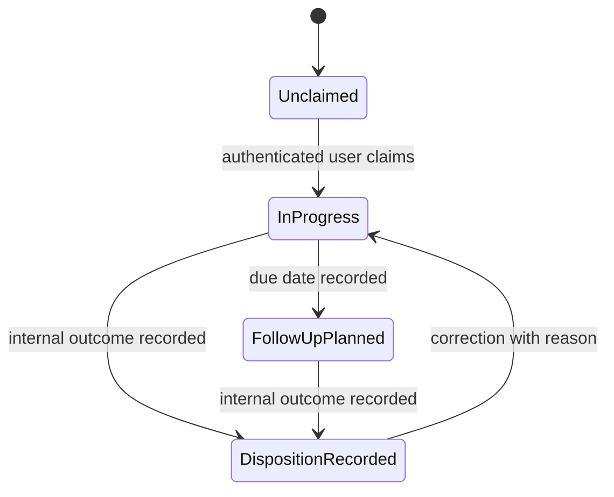

# PDR-007: Bounded Internal Follow-Up and Disposition

- **Status:** Accepted
- **Date:** 2026-08-24
- **Owner:** Product
- **Related features:** SP-F016, SP-F016-A

## Context / Problem

Service Profit R1 detects, prioritizes, and explains tenant-contained opportunities, but the implemented workflow ends after manager review. It does not establish who is accountable for the next internal action or record a durable disposition. This limits pilot learning and prevents later analytics from distinguishing potential revenue from workflow outcomes.

The repository does not contain validated dealer research for outreach ownership, consent, channels, pricing, or production ROI. Existing phone and email values are Service Profit projection fields, not consent or authorization to contact a customer.

## Decision

Define `SP-F016-A` as the stable first slice of the broader deferred `SP-F016` customer outreach/follow-up feature. It is the next implementation candidate, not an approved release commitment.

`SP-F016-A` is an internal, tenant-contained accountability workflow. It may let an authenticated user:

1. claim an opportunity for themselves;
2. record a due date and short internal note when needed;
3. progress a controlled internal follow-up lifecycle;
4. record a controlled disposition and its effective time;
5. view the current state and auditable transition history.

The first slice does not assign work to another user. Self-claiming avoids inventing roles, teams, locations, or directory semantics that the current identity contract does not provide. Reassignment requires a future authoritative organization/user contract and product decision.

Acceptance of this PDR approves the bounded product definition and preparation of an implementation slice. `SP-F016-A` remains **DEFERRED** with no target release until release approval records a baseline, acceptance scope, and validation plan.

## Manager Workflow

A manager starts from the implemented queue and detail workflow. Decision-critical state appears in the existing detail presentation; transition history and optional notes use progressive disclosure. The UI must not become a second queue or a campaign-management surface.

## Ownership Semantics

- Ownership means accountability for this internal follow-up record, not ownership of the customer, vehicle, ServiceOrder, or opportunity source data.
- The server sets `ownerUserRefId` from the authenticated user when that user claims the record.
- The client cannot submit a tenant ID or arbitrary owner ID as authority.
- One active owner exists per opportunity follow-up record in the first slice.
- Claiming is idempotent for the current owner and conflicts safely when another owner or newer version already exists.
- Reassignment, teams, branch routing, workload balancing, and role-based allocation are excluded.

## Lifecycle and Dispositions

Lifecycle and disposition are separate. Lifecycle answers where the internal work is; disposition records the latest controlled outcome.

Initial lifecycle values:

- `UNCLAIMED`: no accountable user;
- `IN_PROGRESS`: claimed and under internal review;
- `FOLLOW_UP_PLANNED`: a due date exists for a permitted manual next step;
- `DISPOSITION_RECORDED`: a controlled outcome has been recorded.

Initial disposition values:

- `FOLLOW_UP_REQUIRED`: evidence supports a future manual follow-up;
- `NO_FOLLOW_UP_DUPLICATE`: another record or action makes follow-up inappropriate;
- `NO_FOLLOW_UP_ALREADY_COMPLETED`: the underlying work is complete;
- `NO_FOLLOW_UP_NOT_APPLICABLE`: the opportunity does not apply after review;
- `DATA_REVIEW_REQUIRED`: source or identity evidence needs correction or investigation;
- `CUSTOMER_INTEREST_RECORDED`: a user records an externally obtained expression of interest;
- `CUSTOMER_DECLINED_RECORDED`: a user records an externally obtained decline;
- `NO_RESPONSE_RECORDED`: a user records an externally performed attempt with no response.

The last three dispositions record a reported external outcome only. AutoVision does not initiate or prove the communication, infer consent, or establish conversion. Product must validate this vocabulary with dealers before release approval.

## Actionability and Safety

- `READY_TO_ACTION` may be claimed, planned, and dispositioned.
- `REVIEW_REQUIRED` may be claimed for review, but follow-up planning and customer-outcome dispositions remain unavailable until an explicit review-confirmed transition is recorded by an authorized user.
- `SUPPRESSED` cannot be claimed, planned, or given a customer-contact outcome. The product continues to show “Do not action” and the suppression reason.
- A later opportunity-state change to `SUPPRESSED` blocks further action while retaining history.
- Internal disposition never changes source evidence or canonical customer, vehicle, ServiceOrder, ServiceJob, or ServiceLine data.

## Audit and Concurrency

Every mutation records tenant, opportunity, actor UserRef, previous and new lifecycle/disposition, server timestamp, version, and an optional controlled reason. History is append-only from the product perspective. Logs must use identifiers and state transitions rather than note or contact content.

Mutations require optimistic concurrency through an explicit version or equivalent conditional contract. Stale writes return a conflict and current safe state; clients do not silently overwrite another user’s decision. Idempotency is required for retried claim and transition requests.

## Data Minimization

Store only fields needed for accountability: tenant/opportunity reference, current owner, lifecycle, disposition, due date, short internal note, audit principals/timestamps, and version. Notes require a documented length limit and must warn users not to enter payment data, credentials, health data, or unnecessary customer details. Define retention and deletion behavior before release approval.

Projected phone/email may be displayed under existing context rules but cannot establish consent, preferred channel, contact authorization, or proof that communication occurred.

## Demo and Measurement

The future demo journey is:

`Detected → Reviewed → Accountable follow-up → Outcome/disposition → eventual conversion/revenue measurement`

Only the first four stages belong to `SP-F016-A`; conversion and recovered-revenue attribution remain future work. The primary view shows owner, due state, and disposition. Audit history and notes remain progressively disclosed.

Candidate product events are `follow_up_claimed`, `follow_up_planned`, `follow_up_disposition_recorded`, and `follow_up_reopened`. Events contain tenant-contained identifiers, actor reference, transition, and timestamp; they exclude note text and contact values. Event naming and retention require architecture review before implementation. These operational events may support later `SP-F017` analytics, but they are not themselves KPI or ROI evidence.

## Explicit Exclusions

- SMS;
- WhatsApp;
- email sending;
- automated customer outreach;
- consent inference;
- campaign management;
- marketing automation;
- arbitrary assignment or reassignment;
- source/master-data correction;
- conversion or recovered-revenue attribution;
- pricing or commercial packaging.

## Rationale

This boundary is commercially meaningful because it connects opportunity review to accountable action and records outcomes needed for pilot learning. It reuses the implemented opportunity, actionability, context, identity, tenant-security, and responsive-detail foundations while avoiding the unsupported regulatory and integration surface of outbound automation.

It is preferred ahead of rich analytics because useful outcome analytics depends on consistent workflow events and dispositions. It is preferred ahead of full outreach because consent, channel, market, and operating ownership remain research gaps.

## Implications

- `SP-F016` remains the deferred umbrella for customer outreach/follow-up.
- `SP-F016-A` receives a stable child-slice identifier and remains deferred until release approval.
- PDR-001 remains valid for implemented R1; this record defines a possible next boundary rather than rewriting R1 history.
- Implementation requires a forward-only migration, explicit mutation permission, server-authoritative tenant checks, safe conflict behavior, shared responsive presentation, and focused security/accessibility tests.
- The business-question register, roadmap, release register, traceability, demo readiness, script, and limitations must distinguish this candidate from implemented behavior.

## Related Sources

[Feature register](../roadmap/feature-register.md), [product roadmap](../roadmap/product-roadmap.md), [release register](../roadmap/release-register.md), [PDR-001](PDR-001-service-profit-r1-revenue-first.md), [ADR-001](../../architecture/decisions/ADR-001-server-authoritative-tenant-authorization.md), [ADR-002](../../architecture/decisions/ADR-002-projection-vs-canonical-ownership.md), [ADR-004](../../architecture/decisions/ADR-004-single-service-profit-detail-presentation.md), [research index](../research/research-index.md), and [demo business questions](../demo/demo-business-question-register.md).

## Review Trigger

Reopen this decision if dealer workflow research rejects self-claiming or the disposition vocabulary; if authoritative assignment, consent, channel, retention, or customer-communication contracts become available; or if release approval changes the first-slice boundary.
