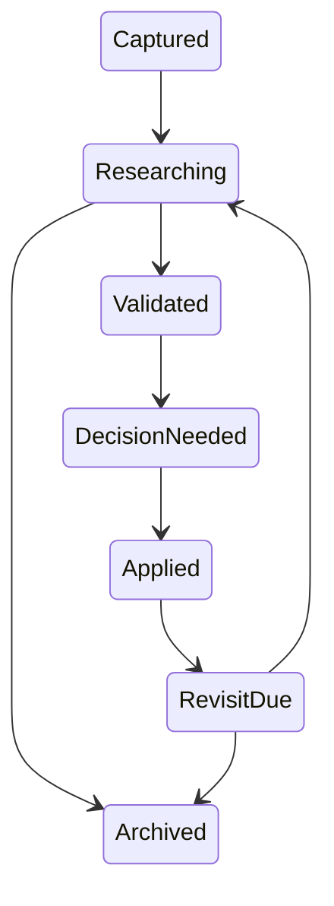

# Product Research Index

## Purpose

This index governs product, dealer, market, workflow, and data research. Research evidence informs decisions but does not itself approve a feature or release.

## Research Record Structure

Each research item should record:

| Field | Meaning |
| --- | --- |
| Research ID | Stable ID such as `RS-001` |
| Question | Decision-relevant question being investigated |
| Date | Collection/publication date; use `Not recorded` when unknown |
| Market | Geographic/regulatory market or `Not specified` |
| Vehicle applicability | Vehicle class and powertrain scope |
| Source | Interview, repository dataset, telemetry, external publication, experiment, or analysis |
| Finding | What the evidence actually supports |
| Confidence | Low, Medium, High, with rationale |
| Product implication | Potential consequence, not automatic commitment |
| Related features | Feature IDs from the feature register |
| Decision required | Product/architecture decision needed |
| Review date | Revisit date or trigger |
| Lifecycle | Current research state |

Do not fabricate citations, interview quotes, dates, sample sizes, or confidence.

## Lifecycle

Use these exact states: **Captured**, **Researching**, **Validated**, **Decision Needed**, **Applied**, **Revisit Due**, **Archived**.

## Current Records

| ID | Question | Source | Finding | Confidence | Lifecycle | Related features | Decision required |
| --- | --- | --- | --- | --- | --- | --- | --- |
| RS-001 | Which Service Profit signals can the R1 demo data support? | [`manifest.json`](../../../demo-data/service-profit/r1/manifest.json) and validation code | Ten synthetic scenarios cover five opportunity types, evidence/actionability states, revenue attribution, and partial cost/disposition capability | High for synthetic behavior; none for production representativeness | Applied | SP-F001, SP-F004, SP-F005 | Revisit with production-like data |
| RS-002 | Are current dealer pain hypotheses externally validated? | No repository source | No interview or external study corpus is recorded | High confidence in the evidence gap | Captured | Future workflow/analytics features | Product research plan required |
| RS-003 | How portable is data readiness across DMS providers/markets? | R1 synthetic India dataset only | Current implementation is DMS-neutral, but cross-provider data availability is unvalidated | Medium confidence in gap | Captured | SP-F004 and future integrations | Select research markets/providers |
| RS-004 | Which vehicle classes/powertrains need distinct policies? | No repository source | Applicability beyond current generic/synthetic scenarios is unknown | High confidence in gap | Captured | Detection policy features | Define research scope |
| RS-005 | Do self-claiming, due-state, and proposed disposition semantics fit dealer operations? | Repository workflow analysis and PDR-007; no dealer study recorded | A bounded model is defined, but ownership, vocabulary, retention, and pilot measures remain unvalidated | High confidence in the evidence gap; low confidence in workflow fit | Captured | SP-F016, SP-F016-A, SP-F017 | Validate with target dealer managers/advisors before release approval |

## Related Research Summaries

- [Dealer pain points](dealer-pain-points.md)
- [Market opportunities](market-opportunities.md)
- [Data availability research](data-availability-research.md)
