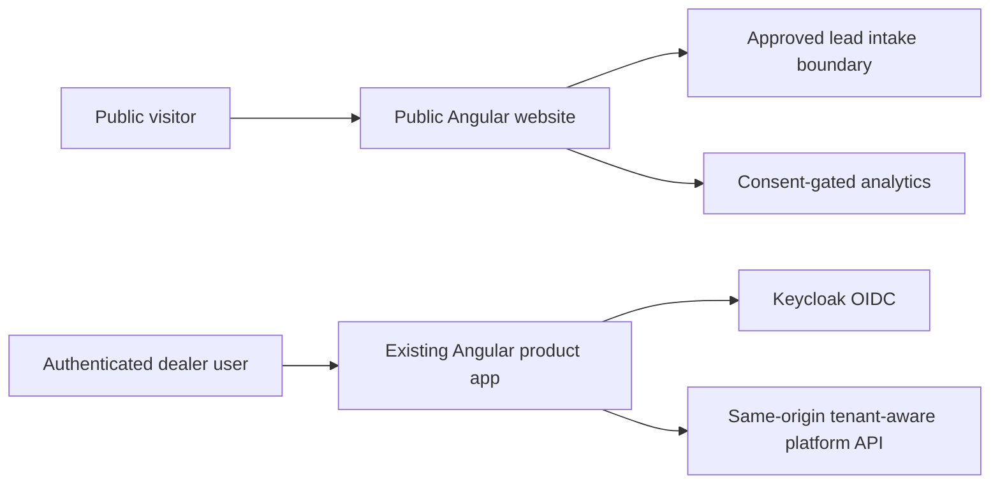

# VSP-W1 Commercial Website Strategy and UX Foundation

**Status:** PLANNED, pending product and architecture review  
**Work mode:** DISCOVERY  
**Scope:** Private/local commercial website foundation for VERSPEN, AutoVision, and Service Profit AI  
**Public launch:** DEFERRED until the separate VERSPEN brand, legal, domain, privacy, and launch gate is approved

## Decision Summary

The website should be a conversion-oriented commercial experience, not a
corporate brochure. Its primary job is to help dealership decision-makers
understand a concrete service-revenue problem, assess whether AutoVision is
relevant, and request a conversation or demo without unsupported claims.

**Recommendation:** create a separately deployable Angular public website
application within this repository, alongside the existing `frontend/`
application. Do not restructure or merge the current authenticated application
as part of VSP-W1.

The existing `frontend/` is the authenticated product runtime: it uses OIDC,
same-origin `/api` calls, Keycloak configuration, tenant-aware platform APIs,
and an authenticated shell. A public site has different security, performance,
SEO, consent, content, and release requirements. A separate application keeps
those boundaries explicit while allowing a deliberately shared design-token
package or documented visual language later. Shared code is an option for a
follow-up architecture decision, not a reason to couple the first delivery.

This recommendation is **PLANNED**, not an approval to create the application
or publish a domain.

## Evidence and Constraints

The repository supports the following positioning:

- AutoVision is an adaptive vehicle service intelligence platform.
- Service Profit R1 identifies service revenue opportunities across declined,
  deferred, due/overdue, and inactive-customer signals for an authenticated
  dealership manager.
- Evidence, explanation, suppression, required review, tenant isolation, and
  DMS-neutral contracts are important product principles.
- The current demo evidence is synthetic and classified
  `SYNTHETIC_DEMO_ONLY`.

Production customer outcomes, ROI percentages, market size, testimonials,
dealer logos, willingness to pay, and comparative benchmarks are
**RESEARCH REQUIRED**. Marketing content must not turn those gaps into claims.
The governing product context is in [product vision](product-vision.md),
[market strategy](market-strategy.md), and the [feature register](../roadmap/feature-register.md).

## 1. Website Architecture Recommendation

### Public website application

**PLANNED:** a public Angular application with its own build artifact,
deployment unit, route tree, content model, analytics/consent boundary, and
release cadence. It may use the same repository and team, but it should be
deployable without rebuilding or releasing the authenticated product.

The first implementation should use statically renderable, semantic page
content and progressive enhancement for interactions. A later SSR or prerender
decision should be made if SEO measurement, content volume, or Core Web Vitals
justify it. Do not introduce a CMS, analytics vendor, or form provider until a
security/privacy owner and data-flow decision exist.

### Existing product application

**IMPLEMENTED:** retain `frontend/` as the authenticated product application.
Its protected routes, OIDC bootstrap, API interceptor, tenant-aware workflows,
and Service Profit manager experience remain unchanged by VSP-W1.

### Why not add public pages to `frontend/`?

| Criterion | Separate public application | Existing application |
| --- | --- | --- |
| Deployment independence | Independent site release and rollback | Public content release coupled to product shell |
| Security boundary | No Keycloak bootstrap or tenant API assumptions on public pages | Auth/runtime concerns are already central |
| Performance | Small public bundle and page-focused assets | Authenticated shell and product code increase payload risk |
| SEO | Dedicated metadata, canonical URLs, robots, sitemap, and crawl policy | Current SPA has minimal document metadata |
| Maintenance | Public content and product workflows have clear ownership | Cross-cutting changes can affect dealer workflows |
| CI/CD | Public preview and launch gates can be isolated | Existing product gates remain entangled |
| Release cadence | Marketing/content cadence can differ from product releases | Product and website changes share a release unit |
| Shared design system | Share tokens or primitives only after ownership is defined | Direct sharing encourages runtime coupling |

The repository's current Nginx configuration proxies `/api/` to the platform
and serves one Angular artifact. A future public deployment should not expose
the authenticated API boundary merely to serve marketing pages. The exact
hosting, DNS, CDN, WAF, and lead endpoint are **RESEARCH REQUIRED** and need a
separate architecture/security review.

## 2. Sitemap

```text
Home
AutoVision
  What AutoVision Is
  Observe -> Predict -> Decide -> Execute -> Verify -> Learn
  Evidence and Explainability
  DMS-Neutral Architecture
Service Profit AI
  The Dealership Opportunity
  Identify and Prioritize
  Advisor and Manager Workflow
  Demo Scenarios
For Dealers
  Dealer Principal / Owner
  Aftersales Director / Manager
  Service Manager
  Service Advisor
Business Value
How It Works
Integration and Security
Request a Demo
About
Contact
Privacy
Terms
Cookie and Consent Preferences
```

The primary navigation should expose `AutoVision`, `Service Profit AI`, `For
Dealers`, `How It Works`, and `Integration & Security`. `Business Value` and
`Request a Demo` should remain easy to reach from navigation and repeated
contextual calls to action. Legal and consent pages belong in the footer.

## 3. Navigation Hierarchy

Use one compact header with the provisional brand relationship visible but not
overstated:

```text
VERSPEN / AutoVision
  AutoVision
  Service Profit AI
  For Dealers
  How It Works
  Integration & Security
  [Request a Demo]
```

On mobile, use a native button-controlled disclosure with a labelled menu,
visible focus, Escape handling, and focus restoration. Do not hide the primary
CTA inside an inaccessible or hover-only menu. Footer navigation should group
product, dealer roles, company, contact, and legal links.

## 4. Page-by-Page Objectives

| Page | Primary objective | Evidence-safe content | Primary action |
| --- | --- | --- | --- |
| Home | Establish the dealership problem and relevance in one visit | Hidden actionable service work; evidence-based intelligence; no outcomes claimed as proven | Request a Demo |
| AutoVision | Explain the platform and its decision loop | Observe -> Predict -> Decide -> Execute -> Verify -> Learn; explainability; DMS neutrality | Explore Service Profit AI |
| Service Profit AI | Make the first commercial capability concrete | Identify, prioritize, review, and operationalize opportunities; synthetic demo scenarios labelled as such | Request a Demo |
| For Dealers | Let each decision-maker recognize their job context | Role-specific questions, workflow value, and limitations | Start a dealer conversation |
| Business Value | Explain how value could be measured | Recovered opportunity concept, service absorption, visibility, and agreed measurement; no fabricated ROI | Discuss measurement |
| How It Works | Reduce perceived implementation uncertainty | Inputs, evidence, prioritization, human review, and follow-through concept | Explore integration |
| Integration & Security | Establish technical credibility and trust | DMS-neutral boundary, API approach, tenant isolation, explainability, deployment questions | Discuss integration |
| Request a Demo | Capture qualified interest with minimal data | Clear expectations, consent notice, validation, and failure state | Submit request |
| About | Explain the relationship between VERSPEN and AutoVision | Provisional brand language; mission; no incorporation or registration claims | Contact |
| Contact | Provide a general route for qualified conversations | Purpose-based contact paths without invented address or phone details | Send enquiry |
| Privacy / Terms / Consent | Make legal and data handling reviewable | Approved policy content only; placeholders remain clearly unpublished | Manage preferences |

## 5. Target Persona Mapping

| Persona | Question to answer | Information priority | Conversion signal |
| --- | --- | --- | --- |
| Dealer principal / owner | Can this improve service economics without adding uncontrolled risk? | Commercial opportunity concept, measurement, safeguards, implementation path | Demo or executive conversation |
| General manager | Where is service performance visibility incomplete? | Cross-functional visibility, prioritization, operating model | Demo |
| Aftersales director / manager | How can teams find and manage recoverable service work? | Opportunity classes, evidence, queue-to-action workflow, KPI definition | Workflow demo |
| Service manager | What can the team act on today, and what requires review? | Prioritization, suppression, ownership, advisor workflow | Service workflow demo |
| Service advisor | Does this help me prepare a relevant customer conversation? | Plain-language rationale, next action, review safeguards, low friction | Role-specific demo |
| Dealer group executive | Can this scale across locations and DMS environments? | DMS neutrality, tenant isolation, integration model, measurement governance | Pilot/design-partner discussion |
| OEM stakeholder | Can the model support a broader service ecosystem? | Provider portability, evidence, governance, integration boundaries | Partnership conversation |
| Technology / DMS partner | Where does integration responsibility sit? | Contracts, APIs, data handling, deployment approach | Integration discussion |

The dealer personas are priority audiences. Persona-specific needs beyond the
implemented manager evidence are **RESEARCH REQUIRED** and should be validated
through the existing dealer discovery work before becoming strong claims.

## 6. CTA Strategy

The primary CTA everywhere is **Request a Demo**. It should be visible in the
header, homepage hero, Service Profit AI conclusion, Integration & Security,
and the final conversion band. The destination must preserve a meaningful
referrer/page context without placing sensitive data in the URL.

The secondary CTA is **Explore AutoVision** and should lead to the platform
explanation, not to a login wall. Contextual alternatives include `Discuss
Measurement`, `Explore Integration`, and `Start a Dealer Conversation`; these
should remain secondary to the demo request and not create competing visual
hierarchies.

CTA copy must describe a conversation, demo, or exploration. Avoid `Get
Guaranteed ROI`, `Recover X% More`, `Autopilot`, or other unsupported promises.

## 7. Homepage Information Hierarchy

1. **Header:** VERSPEN / AutoVision relationship, focused navigation, Request
   a Demo.
2. **Hero:** a concrete proposition: service-revenue opportunities can remain
   hidden in declined, deferred, recommended, overdue, and other actionable
   work. Service Profit AI helps teams identify, prioritize, and operationalize
   those opportunities using evidence-based automotive intelligence.
3. **Problem:** show the operational pattern, not an invented statistic:
   recommendations are made, work is deferred or declined, follow-up is hard
   to see, and managers lack a common evidence-backed queue.
4. **Solution:** introduce AutoVision and Service Profit AI with three or four
   clear jobs: find, prioritize, explain, and guide action.
5. **Workflow:** show the Observe -> Predict -> Decide -> Execute -> Verify ->
   Learn loop, with human review and evidence visible.
6. **Business value:** explain measurable outcome concepts and an agreed
   baseline approach. Label production measurement as a conversation, not a
   result.
7. **Credibility:** evidence, explainability, DMS-neutrality, tenant isolation,
   and integration/security principles.
8. **Demo path:** describe what a demo can show, identify synthetic examples as
   demo-only, and set expectations for a discovery conversation.
9. **Final conversion:** Request a Demo with a short qualification form.
10. **Footer:** legal, privacy, consent, contact, and provisional-brand note as
    appropriate for the private stage.

The first viewport should make the product and dealership problem legible,
with the next section partially visible to invite continuation. Do not use a
generic AI hero, decorative brain/network artwork, fabricated customer proof,
or a dense feature grid as the opening experience.

## 8. Design-System Direction

**PLANNED direction:** premium automotive enterprise, calm and precise. Use a
restrained palette with a light neutral foundation, near-black text, a strong
automotive accent, and one measured highlight color for actions and evidence
states. Avoid purple-gradient startup styling, excessive glow, decorative
orbs, and motion that competes with comprehension.

Use a distinctive, licensed display face for major headings and a highly
legible companion sans for body and interface text. Select and license fonts
before implementation; do not default to a system stack. Define tokens for
color, type scale, spacing, borders, focus, motion, content width, and breakpoints.

Use real product-oriented visual assets where they clarify the story: carefully
composed service-work artifacts, abstracted evidence panels, or approved
product captures with sensitive data removed. Do not use stock imagery as a
substitute for product explanation. Any screenshots must be synthetic or
approved for external use.

Components should favor semantic HTML, native controls, short sections,
comparison tables where useful, and framed cards only for repeated content or
genuinely bounded tools. The visual relationship to the existing AutoVision
product should come from disciplined tokens and information clarity, not from
copying authenticated application screens.

## 9. Responsive Strategy

Design three deliberate compositions:

- **Desktop:** broad editorial canvas, persistent navigation, clear problem to
  solution progression, comparison-friendly persona and integration content.
- **Tablet:** condensed navigation and two-column sections where reading order
  remains clear; preserve the demo CTA and key evidence statements.
- **Mobile:** single-column reading flow, progressive disclosure for technical
  details, compact persona sections, and a short form with large touch targets.

Use CSS media queries and stable layout constraints rather than a runtime
viewport service. Test at representative desktop, tablet, and 390/430px mobile
widths for document overflow, long labels, focus order, menu behavior, form
errors, and CTA visibility. Do not merely stack a desktop layout and call it
responsive.

## 10. Website/App Technical Separation

### Recommended target shape



The public website should not obtain product access tokens, call tenant APIs,
or infer authorization. A lead intake boundary must validate, rate-limit,
spam-protect, minimize, and audit submissions without exposing credentials or
sensitive payloads to the browser beyond what is required. Its ownership and
hosting are **RESEARCH REQUIRED**.

Repository location, shared-token packaging, and CI/CD pipeline shape should be
captured in a follow-up ADR before scaffolding. The default is a sibling such
as `website/` or an explicitly named Angular workspace application, but this
document does not authorize that directory change.

## 11. SEO Architecture

Create one indexable URL per meaningful intent rather than keyword-stuffed
copy. Candidate topic coverage includes:

- automotive aftersales intelligence
- dealership service intelligence
- dealer service profitability
- service revenue recovery
- AI service advisor
- automotive service AI
- dealership management integration

Each indexable page needs a unique title, meta description, canonical URL,
descriptive H1, logical heading hierarchy, meaningful internal links, and
social preview metadata. Add `robots.txt` and `sitemap.xml` only for the
approved private/preview or public host policy; a private preview must not be
accidentally crawlable.

Structured data is justified only after content ownership is approved. Start
with `WebSite` and `SoftwareApplication` or `Organization` only where the
underlying claims are legally and factually approved. Do not publish an
invented address, registration status, review, rating, price, or customer
result in structured data.

Set up Search Console and an Open Graph/Twitter metadata review as launch-gate
tasks, not as evidence of public readiness.

## 12. Analytics Requirements

Analytics must be consent-gated where required by applicable law and should
support a no-consent functional mode. Define an event taxonomy before adding a
vendor:

- page view and approved campaign/referrer context;
- primary and contextual CTA activation;
- demo form started, validation failed, submitted, and submission failed;
- role, country, and high-level enquiry intent only when voluntarily provided;
- scroll or section engagement only if necessary for a stated decision;
- outbound integration/contact actions.

Never send names, email addresses, phone numbers, dealership identifiers,
free-text messages, tokens, cookies, or raw form payloads to analytics. Record
consent version, category, timestamp, and withdrawal behavior according to the
approved privacy design. Provide an analytics-disabled test mode and document
retention, access, processor, and deletion responsibilities.

## 13. Security and Privacy Considerations

- Keep the public site separate from authenticated OIDC and tenant API flows.
- Use HTTPS, secure headers, a restrictive Content Security Policy, and a
  deliberate third-party script inventory.
- Treat demo submissions as personal and potentially business-sensitive data.
  Minimize fields, validate server-side, rate-limit, protect against spam,
  and avoid logging raw payloads.
- Use explicit consent and purpose language for contact follow-up; country and
  role may affect requirements and need legal review.
- Provide privacy, terms, cookie/consent, retention, deletion, and processor
  notices before public launch. Current legal text is **RESEARCH REQUIRED**.
- Do not publish credentials, internal endpoints, tenant identifiers,
  customer data, synthetic-demo confusion, or unapproved product screenshots.
- Define support ownership and incident handling for form delivery and privacy
  requests before enabling the CTA in a public environment.
- The private/local site may show VERSPEN, but must not use `®`, claim trademark
  registration, claim incorporation, invent an address, or imply public launch
  approval.

## 14. Implementation Backlog

All items below are **PLANNED** and remain subject to review.

| ID | Slice | Deliverable | Gate |
| --- | --- | --- | --- |
| VSP-W1.1 | Architecture | Approve separate-app boundary, hosting model, ownership, CI/CD, and shared-token policy | Architecture review |
| VSP-W1.2 | Content | Approve claims register, terminology, provisional-brand language, and evidence labels | Product/legal review |
| VSP-W1.3 | UX | Produce responsive sitemap, wireframes, navigation, form states, and keyboard flows | Product/UX review |
| VSP-W1.4 | Visual system | Define licensed typography, tokens, assets, contrast, focus, and motion rules | Design/accessibility review |
| VSP-W1.5 | Public shell | Scaffold the sibling Angular application with semantic routes and metadata ownership | Architecture gate passed |
| VSP-W1.6 | Homepage | Implement the problem-to-demo information hierarchy with responsive states | Content/UX acceptance |
| VSP-W1.7 | Product pages | Implement AutoVision, Service Profit AI, dealer roles, value, workflow, and integration pages | Evidence review |
| VSP-W1.8 | Lead intake | Select and implement a secure, server-validated demo submission boundary | Security/privacy review |
| VSP-W1.9 | SEO | Add metadata, canonical policy, robots, sitemap, social previews, and justified structured data | SEO/legal review |
| VSP-W1.10 | Analytics | Implement consent-gated, PII-minimized event taxonomy and test mode | Privacy review |
| VSP-W1.11 | Quality | Run unit, build, accessibility, keyboard, responsive, performance, link, and security checks | Release checklist |
| VSP-W1.12 | Launch gate | Approve brand/legal/domain, privacy/terms, operational ownership, and public deployment | Separate launch decision |

## 15. Acceptance Criteria

### Strategy and governance

- [x] The primary conversion objective, audiences, value story, CTA hierarchy,
  sitemap, navigation, personas, responsive approach, SEO, analytics,
  security/privacy, backlog, and technical recommendation are documented.
- [x] The separate public-site recommendation is based on the current
  authenticated Angular/OIDC/tenant runtime and does not require immediate
  repository restructuring.
- [x] Unsupported claims, fabricated proof, and provisional-brand constraints
  are explicit.
- [ ] Product, UX, architecture, security, privacy, and legal reviewers approve
  the relevant gates.

### Future implementation

- [ ] Public pages are independently buildable, deployable, cacheable, and
  rollbackable without releasing the authenticated product.
- [ ] No public route requires Keycloak login, product access tokens, tenant
  identifiers, or authenticated API calls.
- [ ] All pages have semantic landmarks, one meaningful H1, keyboard-complete
  navigation, visible focus, accessible names, appropriate contrast, and
  screen-reader-comprehensible status/error content.
- [ ] Desktop, tablet, and mobile layouts pass overflow, long-content, touch
  target, menu, form, and focus checks.
- [ ] Core Web Vitals and bundle budgets are measured against an agreed target;
  the target is **RESEARCH REQUIRED** until hosting and assets are known.
- [ ] Demo form data is minimized, server-validated, rate-limited,
  spam-protected, consent-aware, and excluded from analytics and ordinary logs.
- [ ] Metadata, canonical URLs, robots policy, sitemap, Open Graph previews, and
  structured data are validated on the approved host.
- [ ] Legal pages, consent behavior, retention/deletion ownership, support
  handling, and launch approval are complete before public deployment.
- [ ] No production customer number, ROI percentage, testimonial, logo,
  address, registration claim, or public launch implication appears without
  approved evidence.

## Review Boundary

This document is the VSP-W1 deliverable for review. **STOP:** do not scaffold,
restructure, publish, connect analytics, or enable a public lead endpoint from
this document alone. A subsequent approved implementation task should cite
this record and the relevant architecture, product, security, privacy, and
brand decisions.