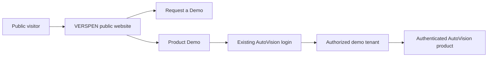
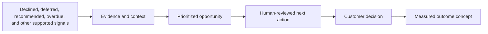

# VSP-W2 Commercial Website UX/UI Design Foundation

**Status:** PLANNED, pending product, UX, architecture, accessibility,
security, privacy, and brand review
**Work mode:** DESIGN / DISCOVERY
**Baseline:** VSP-W1 strategy at `2599b7c` on
`release-r1-service-profit-ai`
**Scope:** Reviewable UX/UI foundation only. No website application,
authentication, lead API, analytics, hosting, or public deployment is created
by this document.

## 1. Executive Design Decision

### Decision

Design a calm, evidence-led commercial website for the hierarchy
`VERSPEN -> AutoVision -> Service Profit AI`. The homepage prioritizes
dealership economic and operational decision-makers, explains the hidden
service-opportunity problem, demonstrates how intelligence supports action,
and leads to **Request a Demo**.

Keep the public commercial website and authenticated AutoVision product as two
independent surfaces. The public website may link to the actual product demo,
but it must not authenticate users, embed product screens, call protected APIs,
or become the product shell.

### Rationale

The commercial journey and the authenticated workflow have different jobs,
risks, release cadences, and performance/SEO requirements. The current Angular
application is an authenticated product shell with OIDC, tenant-aware API
calls, and protected Service Profit routes. VSP-W1 already recommended a
separately deployable public application.

### Evidence

- [VSP-W1 commercial website strategy](commercial-website-strategy.md)
  establishes the separate application boundary and conversion objective.
- [System overview](../../architecture/system-overview.md) identifies Angular,
  Keycloak, same-origin APIs, and tenant-aware platform boundaries.
- [Product vision](product-vision.md) establishes evidence before action,
  human accountability, and secure multi-tenancy.
- [Market strategy](market-strategy.md) states that production outcomes,
  market demand, ROI, and willingness to pay are `RESEARCH REQUIRED`.
- Existing Angular evidence shows native controls, tokenized light styling,
  visible focus, semantic disclosures, and deliberate Service Profit mobile
  behavior.

### Alternatives considered

| Alternative | Decision | Reason |
| --- | --- | --- |
| Add marketing pages to the authenticated Angular shell | REJECT | Couples public SEO/content/release concerns to OIDC, tenant APIs, and product navigation |
| Build a generic AI startup landing page | REJECT | Does not explain the concrete dealership problem or evidence boundary |
| Build a broad multi-product portal now | DEFER | Future-ready information architecture is useful; portal infrastructure is premature |
| Use a product-first dashboard as the homepage | REJECT | Operational product functionality belongs behind authentication |

## 2. Evidence Inspected

### Product and governance

- [VSP-W1 strategy](commercial-website-strategy.md)
- [Product vision](product-vision.md)
- [Market strategy](market-strategy.md)
- [Release strategy](release-strategy.md)
- [Service Profit manager UX](../service-profit-manager-ux.md)
- [Service Profit demo script](../demo/demo-script.md)
- [Service Profit known limitations](../demo/demo-known-limitations.md)

### Architecture, security, and implementation

- [System overview](../../architecture/system-overview.md)
- [Authentication and tenant context](../../architecture/authentication-and-tenant-context.md)
- [Service Profit frontend flow](../../architecture/service-profit-frontend-flow.md)
- [Frontend engineering standards](../../engineering/frontend-standards.md)
- [Security rules](../../../SECURITY.md)
- `frontend/src/app/app.routes.ts`: lazy standalone routes, authenticated
  guard, and product route ownership.
- `frontend/src/app/core/auth/auth.service.ts` and
  `frontend/src/app/core/auth/oidc-adapter.ts`: existing login delegation to
  the OIDC adapter.
- `frontend/src/app/core/auth/auth-bootstrap.service.ts`: OIDC session and
  mapped platform identity bootstrap.
- `frontend/src/app/shell/av-shell.component.ts`: authenticated shell,
  sign-in, profile, sign-out, focus restoration, and responsive navigation.
- `frontend/src/styles/_tokens.scss` and `frontend/src/styles.scss`: current
  light palette, spacing/radius tokens, Arial stack, inherited form styling,
  and global focus treatment.
- Service Profit manager, grouped queue, mobile list, detail, evidence, and
  capability components: evidence-led content, status treatment, native
  controls, responsive cards, and safety-state presentation.

### Evidence limitations

No approved public brand asset library, external font license, production
customer imagery, production dealer results, legal copy, lead-processing
endpoint, analytics vendor, or public domain is recorded. These are
`RESEARCH REQUIRED` or deferred to later gates.

### Design-system baseline variance decision

**Decision:** the current implemented Angular frontend does not use IBM Carbon,
and IBM Carbon is not a frozen mandatory architecture requirement for the
public website. Do not introduce Carbon merely for website consistency. Keep
the public website design-system implementation decision open for VSP-W3.

**Current implementation:** `frontend/package.json` and
`frontend/package-lock.json` contain Angular, Angular build tooling,
`angular-auth-oidc-client`, RxJS, testing, and formatting dependencies; no
`@carbon/*`, `carbon-components*`, or `carbon-components-angular` package is
present. `frontend/angular.json` has no Carbon stylesheet or asset entry.
Searches of `frontend/src` found no Carbon imports, Carbon selectors/modules,
Carbon tokens, or Carbon icon usage. The UI uses native HTML controls and the
local `frontend/src/styles/_tokens.scss` and `frontend/src/styles.scss`
foundation, with small local shared components under
`frontend/src/app/shared`.

**Documented intent:** some repository documentation currently describes the
frontend as `Carbon-based` or as using the IBM Carbon Design System, notably
the [repository map](../../architecture/repository-map.md) and [system
overview](../../architecture/system-overview.md). The
[frontend standards](../../engineering/frontend-standards.md) provide
conditional Carbon-first guidance for a custom interactive control, but do not
mandate Carbon as a dependency or require all frontend surfaces to use it.
The repository constitution mentions Carbon in the context of technology
upgrade governance, not as a frozen UI-framework decision.

**Variance:** documented descriptions overstate the actual implementation.
The variance is documentation-to-implementation drift, not evidence of a
missing installed package or a broken runtime dependency. The current product
UX baseline is native Angular plus local tokens/shared components.

**W2 approach:** preserve the useful implemented principles: semantic native
controls, tokenized styling, visible focus, restrained surfaces, explicit
status text, CSS-owned responsive behavior, progressive disclosure, and
accessible mobile alternatives. Do not install Carbon, change frontend files,
or redesign the website in W2. The W2 `REUSE / ADAPT / NEW` analysis therefore
does not classify Carbon components or tokens as reusable implementation.

**Future decision:** VSP-W3 must evaluate IBM Carbon against lightweight
native/shared primitives for the public site using accessibility,
maintainability, bundle size, visual requirements, licensing, development
effort, localization, and consistency as criteria. A Carbon adoption or a
documentation correction for the existing product should be a separately
reviewed decision; neither is authorized by VSP-W2.

**Status classification:**

| Category | Finding |
| --- | --- |
| IMPLEMENTED | No IBM Carbon dependency, import, selector, token, stylesheet, or component usage found in the current frontend |
| REQUIRED / FROZEN | Not present; no reviewed mandate requires Carbon for the public website or current frontend implementation |
| PROPOSED / HISTORICAL | `Carbon-based` wording in repository map/system overview and conditional Carbon-first guidance in frontend standards |
| NOT PRESENT | Carbon packages in manifests/lockfile, Angular Carbon configuration, Carbon shared folder, or Carbon source usage |

## 3. Brand Hierarchy

The customer-facing hierarchy is fixed for this foundation:

```text
VERSPEN
  AutoVision
    Service Profit AI
```

`VSP` is an internal engineering abbreviation only. It must never appear as a
customer-facing brand, navigation label, page heading, product name, demo
label, or marketing term.

### Brand treatment decision

**Decision:** show `VERSPEN` as the provisional master-brand name, `AutoVision`
as the platform/product identity, and `Service Profit AI` as the current
commercial solution. Use a compact relationship lockup such as `VERSPEN /
AutoVision` in the website header, with the product name carrying the strongest
weight on product pages.

**Rationale:** this makes ownership and product scope legible without making
the website a corporate brochure or implying that the legal launch gate has
passed.

**Status:** PLANNED and reversible. Do not use registered-trademark notation,
claim registration or incorporation, invent company details, or imply public
launch approval.

### Future multi-product readiness

Reserve a product navigation model that can later become:

```text
VERSPEN
  AutoVision
    Service Profit AI
    Future AutoVision capabilities
  Future VERSPEN products
```

For this release, do not build a product portal or product switcher. A future
product selector can be introduced as a grouped `Products` navigation item
when a second approved product exists; current page URLs and the AutoVision
product hierarchy should not need to change.

## 4. Public Website and Product Boundary

| Surface | Owns | Must not own |
| --- | --- | --- |
| Public commercial website | Company/product explanation, SEO content, business value, contact, sales demo request, Product Demo link | OIDC, product sessions, tenant decisions, protected data, operational workflows |
| Authenticated AutoVision product | Login, demo tenant, tenant-aware APIs, Service Profit workflows, evidence and safety states | Corporate marketing navigation, public lead capture, public analytics consent model |

The transition is a browser navigation between applications, not an embed or
shared authenticated session owned by the website:



The public website must not expose tenant IDs, customer data, development
diagnostics, credentials, tokens, or internal endpoints. The existing
authentication, authorization, and tenant-isolation implementation remains
unchanged by VSP-W2.

## 5. Request Demo and Product Demo Model

These are separate journeys with different intent and language.

| Journey | Audience | Label | Destination | Success signal |
| --- | --- | --- | --- | --- |
| Sales conversion | Prospective dealer/customer, design partner, or pilot participant | **Request a Demo** | Minimal lead form and confirmation state | Qualified enquiry captured through an approved future intake boundary |
| Product access | Authorized demo user | **Product Demo** | Existing AutoVision login boundary | User reaches the authorized demo tenant and product landing state |
| Discovery | Any visitor still learning | **Explore AutoVision** | AutoVision platform page | Visitor understands lifecycle, evidence, and architecture |

### Authenticated-demo label decision

**Decision:** use **Product Demo** as the final customer-facing label.

**Rationale:** it distinguishes access to the real product from a sales request,
does not imply that the user is launching an unattended or public environment,
and matches the established product identity. `Launch Demo` is a useful
internal presenter phrase but is ambiguous for first-time visitors.

**Status:** PLANNED. Product access and authorization remain owned by the
existing AutoVision application.

## 6. Demo Authentication Transition

### Recommended approach: direct redirect to existing login

**Decision:** the public site's `Product Demo` CTA should route directly to the
existing AutoVision login boundary. Do not add a second introduction page by
default.

**Rationale:** an authorized demo user has already expressed access intent;
another page adds friction and risks making the public site appear to own
authentication. The destination can provide the necessary product context in
its own unauthenticated login presentation.

**Alternative:** a short demo introduction page is `DEFERRED` and may be
considered only if usability research shows that users need pre-login
instructions, access requirements, or a clear distinction between sales and
authorized access.

### Intended flow

1. `Product Demo` is available in the public header, homepage hero as a
   secondary access action, relevant product pages, and footer.
2. Activation navigates to the existing AutoVision login URL/boundary. The
   public site does not create a token, session, or login state.
3. The login surface identifies the destination as **AutoVision by VERSPEN**
   and explains that authorized demo access is required. This is visual/UX
   continuity guidance only; no auth implementation change is part of W2.
4. Existing OIDC/PKCE and tenant authorization proceed unchanged.
5. After successful authentication, the demo user lands in an intentional
   AutoVision demo landing experience or existing Service Profit manager entry,
   subject to a separate product UX decision.
6. A visible, non-sensitive demo-tenant indicator and synthetic-data notice
   should be present in the authenticated product where the product contract
   supports it. This is not implemented or changed in W2.

### Failure, logout, and return intent

| State | Intended behavior |
| --- | --- |
| No demo authorization | Existing login/access guidance; do not offer a bypass or create a public session |
| Expired/invalid session | Existing AutoVision unauthorized/session-renewal behavior; preserve no sensitive return data |
| Demo unavailable | A plain-language state owned by the product boundary with a route back to public site and Request a Demo |
| Successful logout | Existing product logout; a deliberate return link may lead to the public homepage without carrying sensitive context |
| Mobile transition | Full-page navigation, clear destination title, no embedded or clipped login panel |
| Keyboard/screen reader | Destination is announced as AutoVision login; focus starts at the page heading or first actionable control |

## 7. Visual Design Direction

### Direction

**Evidence in motion, without spectacle.** The visual language should feel like
an intelligent automotive operations company: quiet authority, precise
typography, structured information, and meaningful product evidence. Automotive
context should come from service signals, work states, vehicle/service detail,
and disciplined geometry, not from car-sale imagery or futuristic effects.

### Visual principles

- Use a light, high-contrast foundation with deep ink and restrained teal/green
  automotive accents derived from the existing product tokens.
- Add a warm, controlled signal color for commercial emphasis so the page does
  not read as one hue family or as a purple AI template.
- Make the product/problem visible in the first viewport; avoid an enormous
  empty hero.
- Prefer diagrammatic evidence trails, redacted product views, and controlled
  data panels over stock photographs or decorative AI illustrations.
- Use hard-edged or lightly rounded surfaces, shallow elevation, and clear
  borders. Avoid glassmorphism, glowing edges, or nested card stacks.
- Use motion for reveal, state, or flow explanation only. Honor reduced motion.

## 8. REUSE / ADAPT / NEW Analysis

| Foundation | Decision | Treatment |
| --- | --- | --- |
| Typography | ADAPT | Preserve readable hierarchy and numeric clarity; replace Arial only after licensed, localization-tested font selection |
| Colors | ADAPT | Reuse the current ink/canvas/surface/status intent; expand into a public brand palette with approved VERSPEN and AutoVision roles |
| Spacing | REUSE | Retain the current rem-based rhythm and 44px-class interactive target intent; add public section-scale tokens |
| Grid | ADAPT | Retain constrained content and responsive discipline; create an editorial public grid rather than product workspace layouts |
| Buttons | ADAPT | Preserve native semantic controls, focus, min-height, and primary/secondary hierarchy; add link/button variants for public CTAs |
| Icons | ADAPT | Retain familiar, labelled utility-icon practice; use a licensed/approved icon source and never make icons carry meaning alone |
| Cards | ADAPT | Retain restrained borders and low radius; use only for repeated value/evidence items, not whole page sections |
| Navigation | NEW | Public corporate/product hierarchy, mobile disclosure, and sales/access CTA model do not exist in the product shell |
| Forms | ADAPT | Reuse native label/error/focus conventions; create a minimal sales enquiry pattern with privacy and future server states |
| Data visualization | ADAPT | Reuse evidence/status clarity and money caution; simplify for explanation and remove tenant/customer identifiers |
| Responsive behavior | REUSE | Preserve CSS-owned breakpoints, semantic mobile cards, progressive disclosure, and overflow testing discipline |
| Accessibility | REUSE | Carry forward semantic HTML, visible focus, live status, text alternatives, and non-color state communication |
| Motion | ADAPT | Retain reduced-motion awareness; add only purposeful public-page flow/reveal transitions |
| Product screenshot presentation | ADAPT | Use controlled synthetic/approved captures in a public frame, with disclosure and redaction |
| Security/trust presentation | NEW | Public-facing explanation of evidence, human control, DMS-neutrality, and tenant-aware architecture needs a new narrative component |

Do not create a large independent design system. Tokens and public components
should be shared only through an approved future ownership decision, with no
runtime coupling to the authenticated application required. IBM Carbon remains
an open VSP-W3 evaluation; it is not a W2 dependency or reuse obligation.

## 9. Design-Token Proposal

Values below are provisional design decisions for review, not CSS or code.

### Layout and shape

| Token | Proposed value | Use |
| --- | --- | --- |
| Content max | `72rem` | Main reading and conversion content |
| Wide content max | `84rem` | Evidence/workflow visuals that need additional width |
| Page gutters | `clamp(1rem, 4vw, 4rem)` | Desktop/tablet/mobile outer rhythm |
| Radius small | `0.25rem` | Inputs, buttons, small framed elements |
| Radius medium | `0.5rem` | Repeated cards and bounded media frames |
| Radius large | `0.75rem` maximum | Only large product/screenshot frame if needed |
| Border | 1px solid token | Separation and focus-adjacent structure |
| Elevation | 0 to 2 restrained shadow levels | Hierarchy, never decorative floating stacks |

### Type scale

Use a capped, responsive scale with CSS `clamp()` and no viewport-dependent
font-size-only scaling. Proposed roles:

| Role | Desktop range | Mobile range | Use |
| --- | --- | --- | --- |
| Display | 3.75rem max | 2.5rem max | Hero headline only |
| H1 | 3rem max | 2.25rem max | Page title |
| H2 | 2.25rem max | 1.75rem max | Major section |
| H3 | 1.5rem | 1.3rem | Feature/workflow group |
| Body large | 1.2rem | 1.05rem | Hero support and lead-ins |
| Body | 1rem | 1rem | Reading content |
| Label | 0.75-0.875rem | 0.75-0.875rem | Eyebrows, metadata, controls |

Line height should generally be 1.1-1.2 for display headings and 1.45-1.65
for body copy. Letter spacing remains zero unless a specifically approved wordmark
requires otherwise.

### Spacing rhythm

Use a 4px base rhythm expressed in rem-equivalent steps:

```text
space-1  .25rem    space-2  .5rem     space-3  .75rem
space-4  1rem      space-5  1.5rem    space-6  2rem
space-7  3rem      space-8  4rem      space-9  6rem
```

Use `space-8` to `space-9` for major desktop section separation and reduce to
`space-6` or `space-7` on mobile when the reading sequence benefits.

### Interaction and status

- Interactive controls: minimum 2.75rem block size where practical.
- Focus ring: 3px high-contrast outline with 2px offset, never color-only.
- Motion fast: 120-160ms for disclosure/state.
- Motion standard: 220-280ms for section transition.
- Motion slow: 400ms maximum for a meaningful workflow reveal.
- Status colors require text/icon/shape redundancy and approved contrast.

## 10. Typography Strategy

### Decision

Use one expressive but restrained licensed display family for headings and one
high-legibility sans family for body, controls, and data. Keep numerals
tabular or otherwise stable where values are compared. Load only the weights
actually used, self-host or approve a privacy-reviewed font source, and provide
fallbacks that preserve metrics as closely as possible.

### Rationale and constraints

The current Arial stack is functional but not distinctive. A commercial site
needs a stronger identity, but font licensing, performance, browser support,
localization, and numeric clarity matter more than novelty. Font selection is
`RESEARCH REQUIRED` until brand and licensing review.

Do not use a decorative face for body content, labels, form errors, or status
communication. Test Latin expansion and future localization scripts before
freezing the choice.

## 11. Color and Surface Strategy

### Roles

| Role | Direction |
| --- | --- |
| VERSPEN identity | Quiet master-brand ink/mark treatment; provisional and easy to replace |
| AutoVision identity | Deep operational ink with existing brand-accent continuity |
| Service Profit AI | Controlled warm signal accent for opportunity/commercial emphasis |
| Canvas | Light neutral with subtle tonal variation, never a flat white-only page |
| Surface | Near-white or lightly tinted panels with border separation |
| Evidence | Blue/teal information role only when text and icon reinforce it |
| Caution/review | Amber-like role with explicit review text |
| Safe/ready | Green role with explicit actionability text |
| Suppressed/error | Red role with reason and action instruction |

Use color for grouping and emphasis, not as the sole encoding of evidence
strength, readiness, review, or suppression. Validate every foreground/surface
pair to WCAG 2.2 AA. A future dark theme is `DEFERRED`; token roles should not
make it impossible, but dark-mode implementation is outside W2.

## 12. Grid and Spacing Foundation

### Decision

Use a 12-column desktop grid with a 72rem content cap, 8-column tablet
composition, and 4-column/mobile single-flow composition. The public grid is
editorial and explanatory; it is not the dense operational grid used by the
Service Profit manager.

### Proposed ranges

| Range | Layout | Gutters | Behavior |
| --- | --- | --- | --- |
| Desktop `>1100px` | 12 columns, 24px minimum gap | `clamp(2rem, 4vw, 4rem)` | Persistent nav; two-column hero; comparison-friendly sections |
| Tablet `721-1100px` | 8 columns, 20px gap | `clamp(1.5rem, 4vw, 3rem)` | Condensed nav; selected two-column sections; visuals remain readable |
| Mobile `<=720px` | 4-column utility grid or one reading column | `1rem` minimum | Single flow; progressive disclosure; full-width primary CTA |

These ranges align with the current product's responsive breakpoints for
conceptual continuity, while the public site must still validate its own
content and composition.

## 13. Responsive Strategy

### Desktop

The header keeps the primary CTA visible. The hero uses a text-led left column
and a meaningful evidence visualization on the right. Workflow and platform
sections may use horizontal sequences, but every step must remain readable and
have a linear alternative. Business-value and integration content can compare
concepts in two columns.

### Tablet

The navigation condenses before it becomes crowded. The hero moves to a
balanced two-row composition, preserving the visualization beside or beneath
the value proposition. Workflow steps wrap into two rows with an explicit
reading order. Persona and trust blocks use two columns only when labels do not
wrap awkwardly.

### Mobile

The header uses a labelled disclosure menu and retains `Request a Demo` as a
prominent action. The hero becomes a single reading sequence: problem,
solution, visual evidence, primary CTA, secondary exploration, then Product
Demo. Horizontal lifecycle diagrams become a vertical step list or a
scrollable, keyboard-accessible rail with a text summary. Cards become full
width, not nested, and technical details use native disclosure.

Forms use one column, visible required/optional labels, autofill-compatible
autocomplete values, and errors adjacent to their fields. No horizontal page
overflow is acceptable. Zoom to 200% and long translated labels must remain
usable.

## 14. Navigation Architecture

### Header

```text
VERSPEN / AutoVision
  AutoVision
  Service Profit AI
  For Dealers
  Business Value
  How It Works
  Integration & Security
  [Product Demo]
  [Request a Demo]
```

On desktop, group `Business Value`, `How It Works`, and `Integration &
Security` under a `Understand` or `Platform` menu only if testing shows the
header is too wide. Do not expose every sitemap node as a top-level item.
`Request a Demo` is the visually dominant action; `Product Demo` is a clearly
separate outlined or text action.

### Footer

Group links under `Products`, `For Dealers`, `Company`, `Contact`, and `Legal`.
Include `Product Demo` in a product/access group rather than making it look
like a sales form. Include privacy, terms, and consent preferences only when
approved content exists; placeholders must not masquerade as final legal text.

## 15. Homepage Information Architecture

The page answers the required questions in this order:

1. What dealership problem does this solve?
2. What is AutoVision?
3. What does Service Profit AI do?
4. Why does leadership care?
5. How does the intelligence work?
6. How does it fit the DMS/data environment?
7. Can it be trusted?
8. Can I see the product?
9. How do I request a guided demo?
10. What should I do next?

## 16. Detailed Homepage Wireframe

### 0. Utility/header band

**Content:** provisional `VERSPEN / AutoVision` lockup, primary navigation,
`Product Demo`, and `Request a Demo`.
**Desktop:** persistent compact header.
**Tablet:** reduced nav with disclosure.
**Mobile:** menu button plus visible Request a Demo action; Product Demo in
the opened menu and optionally as a compact secondary link.
**Accessibility:** skip link, landmark navigation, labelled menu button,
Escape close, focus restoration, no hover-only content.

### 1. Hero: service opportunity, made visible

**Eyebrow:** `AutoVision / Service Profit AI`
**Headline direction:** `Make overlooked service opportunities easier to see and act on.`
**Support direction:** Service teams have declined, deferred, recommended,
overdue, and other evidence-supported service work that can be difficult to
prioritize consistently. Service Profit AI helps teams identify and review
these opportunities through evidence-based automotive intelligence.
**Actions:** `Request a Demo` primary; `Explore AutoVision` secondary; `Product
Demo` authenticated access.
**Visual:** a controlled evidence path from service signal to opportunity card
to priority/action state, with redacted/synthetic labels.
**Desktop:** copy and CTA left; visualization right, with the next problem
section visibly beginning below.
**Tablet:** copy first, visualization second.
**Mobile:** headline, support, primary CTA, then a compact vertical visual; do
not put three equal buttons in one row.

No headline may claim recovered revenue, ROI, customer adoption, or automated
outcomes. The phrase `make easier to see and act on` describes intended value,
not a measured result.

### 2. Problem: where service value becomes hard to follow

Show four operational moments: recommendation made, work declined/deferred,
follow-up becomes difficult to organize, and managers lack a common evidence
view. Use a short narrative and a simple signal-to-queue illustration. Do not
use an invented percentage or imply all signals are always available.

### 3. Service Profit AI: opportunity to action

Present the sequence:

```text
Opportunity -> Evidence -> Priority -> Action -> Outcome
```

Each step has one sentence and one visual state. `Outcome` is framed as the
`measurement concept` and customer decision to be observed, not a proven result.
Show suppression and human review as trust-preserving states, not as footnotes.

### 4. How It Works: evidence into decisions

Show inputs, evidence interpretation, prioritization, human decision, and
follow-up/`measurement concept`. Separate implemented R1 behavior from planned
future execution and outcome measurement. Use a vertical mobile sequence.

### 5. AutoVision platform lifecycle

Show:

```text
OBSERVE -> PREDICT -> DECIDE -> EXECUTE -> VERIFY -> LEARN
```

Use six connected but individually understandable blocks. `Execute` must be
described as a workflow direction, not as a claim that autonomous customer
outreach is implemented. Add a text alternative that explains each stage.

### 6. Business value

Use three outcome categories: recovered opportunity visibility, service
operational focus, and measurable follow-up/learning. Explain a future baseline,
agreed measurement window, evidence quality, and disposition. Do not display
fake metric tiles, ROI percentages, customer counts, or comparative claims.

### 7. Integration

Explain a DMS-neutral, API-oriented boundary: source signals, controlled data
handling, provider portability, and integration discovery. Avoid naming an
unapproved DMS, connector, partner, or deployment result.

### 8. Trust and control

Four trust blocks: evidence and explanation, human review, suppression/safe
states, and tenant-aware enterprise architecture. Make clear that the public
site is not itself the security boundary; authenticated product authorization
remains server authoritative.

### 9. Persona value

Prioritize leadership and aftersales management with three blocks: dealer
leadership, aftersales management, service operations. Keep advisor relevance
as a supporting path rather than giving every persona equal hero weight.

### 10. Product view and demo paths

Show one controlled product frame or simplified queue/evidence visualization,
marked `Illustrative Service Profit AI demo view` and `Synthetic/demo data`.
Place `Product Demo` beside an explanation that it is for authorized users,
while `Request a Demo` starts the sales journey.

### 11. Final conversion band

Repeat `Request a Demo`, state what the conversation covers, and provide a
secondary `Explore AutoVision` link. Keep the form on its own route or clearly
bounded section, not an intrusive modal.

### 12. Footer

VERSPEN, AutoVision, product links, company/about, contact, Product Demo,
privacy, terms, consent preferences, and the provisional-brand/launch status
where appropriate to the private stage.

## 17. Header Design

The header is a quiet orientation device, not a dashboard toolbar. Use a
wordmark/lockup that can be replaced if VERSPEN legal clearance changes.
Keep `Request a Demo` persistent at desktop and mobile where space permits.
Use a native menu button on smaller screens. Product Demo is secondary and
must never resemble a form submit action.

Focus moves into the opened menu, closes on Escape, returns to the trigger, and
does not disappear when navigation occurs. The header has one navigation
landmark and one primary CTA label.

## 18. Hero Design

### Content hierarchy

1. Small relationship/product eyebrow.
2. Concrete dealership-problem headline.
3. Evidence-safe value explanation.
4. Request a Demo.
5. Explore AutoVision.
6. Product Demo for authorized access.
7. Meaningful product/evidence visualization.

### Visual concept

Use a `signal rail` that starts with abstracted service-history/work states,
passes through an evidence panel, and ends in a prioritized opportunity card
with visible `Review` or `Ready` text. The visual should resemble a product
explanation, not a futuristic control room. Any populated values are synthetic
and clearly disclosed.

## 19. Company/Product Hierarchy Treatment

Company pages answer who VERSPEN is and what it intends to build. Product
pages answer what AutoVision does and how Service Profit AI applies it to
dealership service operations. Do not put operational queue actions, customer
records, authenticated status, or tenant-specific metrics on company pages.

About content remains provisional: purpose and product philosophy may be
written, but incorporation, registration, address, staff, partners, customer
logos, and market presence require approved evidence.

## 20. AutoVision Visualization Approach

### Decision

Use a layered combination of a lifecycle diagram, a simplified evidence path,
and one controlled product screenshot frame. Do not rely on a single dashboard
mockup to explain the platform.

### Rules

- Prefer an approved product capture when it clarifies a real workflow.
- Otherwise use a controlled mockup that is visibly illustrative, not a fake
  production screen.
- Redact or replace all names, phone numbers, emails, VINs, registrations,
  tenant IDs, tokens, internal URLs, and diagnostics.
- Label synthetic/demo content near the visual, not only in a distant footer.
- Provide a text description and a linear equivalent for every diagram.

## 21. Service Profit AI Visual Story



The visual distinguishes `opportunity identified` from `revenue recovered.`
The last two steps are future measurement and customer outcomes, not current
proof. Suppressed and review-required states should appear as visible branches
that prevent unsafe action.

## 22. Business-Value Presentation

Use an evidence-to-measurement frame:

```text
Baseline -> Identified opportunity -> Reviewed action -> Disposition -> Outcome measurement
```

Describe service absorption, visibility, prioritization, and potential recovered
opportunity as categories to discuss. A future buyer conversation should agree
on source data, time window, attribution, exclusions, and outcome definitions.
Production KPI targets and ROI are `RESEARCH REQUIRED`.

## 23. Integration and Security Presentation

Use a two-layer composition:

1. **Integration:** DMS-neutral input boundary, API-oriented contracts,
   provider portability, controlled source mapping, and implementation
   discovery.
2. **Trust:** tenant isolation, server-authoritative authorization,
   evidence/explainability, human review, suppression, and auditability.

Keep security statements precise. Say that the product architecture is
tenant-aware and authorization is server authoritative where repository
evidence supports it. Do not claim certifications, compliance status, uptime,
encryption details, or production deployments without approved evidence.

## 24. Public Component Inventory

| Component | Purpose | Content | Responsive behavior | Accessibility behavior | Classification |
| --- | --- | --- | --- | --- | --- |
| Corporate Header | Orient brand and primary journeys | VERSPEN/AutoVision lockup, nav, CTAs | Persistent desktop; disclosure tablet/mobile | Skip link, nav landmark, labelled menu, focus restoration | NEW |
| Primary Navigation | Move between high-intent pages | Grouped product/platform links | Condenses before collision | Native links, current-page indication | NEW |
| Mobile Navigation | Provide complete small-screen navigation | Full link set and CTAs | Full-width disclosure, no hover dependency | Escape, focus trap/return, `aria-expanded` | NEW |
| Product Navigation | Explain AutoVision grouping | AutoVision, Service Profit AI, future slot | Local subnav or grouped menu | Heading and current link semantics | NEW |
| Hero | Establish problem, relevance, action | Headline, support, visual, CTAs | Two-column to linear stack | One H1, meaningful image alternative | ADAPT |
| Section Heading | Create scan hierarchy | Eyebrow, H2, short lead | Text wraps without collision | Correct heading level, no text in image | REUSE |
| Value Proposition Block | Explain business relevance | Job, evidence, limitation, link | Grid to vertical list | Semantic article/heading | ADAPT |
| Evidence Block | Explain why an opportunity is credible | Signal, source, confidence/review state | Stacks on mobile | Status text and non-color encoding | ADAPT |
| Metric/Stat Block | Show approved `measurement concept`s | Label, value only when evidence exists | Wraps with stable dimensions | Unit/context announced; no fake numbers | ADAPT |
| Feature Card | Group repeated capabilities | Title, concise description, link | Full-width mobile | Article/list semantics | ADAPT |
| Product Capability Card | Explain AutoVision capability | Capability, evidence, status | One column mobile | Status text and link name | NEW |
| Workflow Visualization | Explain signal-to-outcome story | Steps, arrows, text alternative | Vertical mobile/linear fallback | `figure` caption and full text equivalent | NEW |
| Lifecycle Visualization | Explain Observe through Learn | Six stages and descriptions | Wrap/vertical sequence | Ordered list equivalent | NEW |
| Service Profit Opportunity Visualization | Make product value concrete | Opportunity, evidence, priority, action | Controlled scroll/stack | Caption, labels, synthetic disclosure | NEW |
| Product Screenshot Frame | Show real/controlled product context | Approved/redacted capture, caption | Scales within frame; no crop of key data | Alt text and adjacent description | ADAPT |
| Integration Block | Explain DMS/API fit | Boundary, inputs, questions | Two-to-one column | Heading and list semantics | NEW |
| Security/Trust Block | Establish safe operating principles | Evidence, human control, tenant-aware architecture | Stack on mobile | Text, not shield icon alone | NEW |
| Persona Value Block | Route role-relevant value | Leadership, aftersales, operations | Three-to-one column | Heading/link per role | NEW |
| CTA Banner | Provide clear next step | Request Demo, expectation, alternate link | Full-width stacked mobile | Button/link names remain explicit | ADAPT |
| Request Demo Form | Capture qualified sales interest | Minimal fields, privacy copy | One-column mobile | Labels, errors, status announcements | ADAPT |
| Product Demo Entry | Route authorized users | Product Demo label and access note | Header/footer/hero placement | Destination announced in link name | NEW |
| Footer | Provide secondary navigation and legal | Products, company, contact, legal | Columns to stacked groups | Navigation landmarks and headings | NEW |
| Legal Navigation | Reach approved policies/preferences | Privacy, terms, consent | Stacked mobile | Clear link names | NEW |
| Empty/Error/Unavailable Demo State | Explain unavailable access | Cause-safe message, retry/back/contact | Full-width readable state | Live status, heading, recovery action | NEW |

## 25. Request Demo UX

### Form model

**Required:** Name, work email, company/dealership, country, role.
**Optional:** Number of locations, current DMS, message.

Do not request phone, address, VIN, customer details, passwords, financial
information, or other data not needed for initial qualification.

### Validation and states

- Associate every label programmatically with its control.
- Mark required and optional fields in text, not color alone.
- Validate required fields, email shape, reasonable length, country selection,
  and message limits both client-side for feedback and server-side later.
- Put the error beside the field, summarize errors near the form heading, and
  move focus to the summary on submit failure.
- Announce submission progress politely and disable duplicate submission without
  trapping keyboard users.
- Success confirms receipt without promising a response time that has not been
  agreed. It offers `Explore AutoVision` and `Product Demo` separately.
- Server failure gives a safe retry path and an alternative contact route only
  when an approved route exists. Never echo raw backend details.

### Privacy, autofill, and abuse

Use `name`, `email`, `organization`, `country`, and role-appropriate
autocomplete values. Explain purpose, expected follow-up, retention, and
privacy policy before submission. Consent requirements vary by country and are
`RESEARCH REQUIRED`.

Later implementation must use server validation, rate limiting, spam/abuse
protection, CSRF/origin controls as applicable, safe error handling, restricted
access, retention/deletion ownership, and sanitized logs. None is configured in
W2.

## 26. Product Demo UX

`Product Demo` is a link, not a lead form. It appears in the header, relevant
product sections, homepage hero as a secondary action, and footer.

The destination is the existing AutoVision login boundary. The public site
should not collect demo credentials, explain internal tenant setup, embed the
login form, or promise access to unauthorized visitors. The link copy or nearby
support text should say `For authorized demo access` where space allows.

## 27. Login Transition UX

The login surface should visually continue the relationship with a compact
identity treatment:

```text
AutoVision
by VERSPEN
Authorized product access
```

This is a presentation recommendation only. Do not change OIDC, PKCE,
Keycloak, callback, token, session, or tenant behavior in W2. The browser
transition should be a full navigation with a clear page title and no
cross-origin product data exposed by the public site.

## 28. Post-Login Demo Intent

### Recommendation

After successful demo authentication, the user should reach a deliberate
AutoVision landing state that identifies the demo context, points to the
Service Profit AI opportunity queue, and discloses `Synthetic/demo data` before
the user interprets results.

The exact landing route is `RESEARCH REQUIRED` / a separate product UX
decision. Candidate order:

1. Demo landing orientation with `Open Service Profit AI` action.
2. Service Profit manager queue with a persistent demo disclosure and clear
   product identity.

The existing R1 demo narrative supports the manager summary, opportunity queue,
evidence explanation, suppression, review-required states, and responsive
detail. It does not support production outcome claims, customer outreach, or
complete ROI attribution.

Logout remains owned by AutoVision. A return-to-website link should be
non-sensitive and should not erase or bypass the existing logout flow.

## 29. Accessibility Specification

Target **WCAG 2.2 AA**.

- Use one meaningful H1 per page, ordered H2/H3 sections, and semantic
  `header`, `nav`, `main`, `section`, `footer`, `form`, `figure`, and `ol/ul`
  landmarks.
- Provide a skip link and visible `:focus-visible` treatment with sufficient
  contrast and offset.
- Use native links, buttons, inputs, selects, fieldsets/legends, and details
  before ARIA. Add ARIA only to expose actual disclosure, tab, busy, or status
  state.
- Ensure mobile menu Escape behavior, focus placement, focus restoration, and
  no keyboard trap.
- Associate errors with controls using `aria-describedby`, mark invalid state,
  and announce the summary after submit.
- Announce loading, success, and server-failure states through polite live
  regions where appropriate.
- Express product states such as `Review required`, `Ready to action`, and
  `Suppressed` in text and not color alone.
- Give every diagram a caption plus a complete linear text alternative. Images
  need useful alt text; decorative assets use empty alt text.
- Keep text usable at 200% zoom, support reflow, and prevent horizontal page
  overflow at mobile widths.
- Provide touch targets around 44 CSS pixels where practical.
- Respect `prefers-reduced-motion`; no essential meaning may depend on motion.
- Test with keyboard, screen reader smoke checks, automated Axe, contrast tools,
  zoom/reflow, and real mobile interaction. Automation is not a substitute for
  assistive-technology review.

## 30. Motion Specification

Motion may communicate:

- menu opening and closing;
- progressive section hierarchy;
- lifecycle step connection;
- form submission feedback;
- product visual state transitions.

Use short opacity/position changes and restrained line/step reveals. Do not use
continuous background animation, particles, parallax, neon pulses, auto-rotating
carousels, or motion that delays content. Disable or substantially reduce
nonessential motion for `prefers-reduced-motion: reduce`.

## 31. SEO-Aware Content Structure

Each page should have a descriptive title, unique meta description, canonical
URL policy, one H1, descriptive links, crawlable text, and approved social
preview content. Candidate page intent maps are:

| Page | Topic family |
| --- | --- |
| AutoVision | Automotive aftersales intelligence; adaptive vehicle service intelligence |
| Service Profit AI | Dealership service intelligence; service revenue recovery |
| Business Value | Dealer service profitability; measurable service outcomes |
| How It Works | Evidence-based automotive intelligence; service workflow |
| Integration & Security | Dealership management integration; DMS-neutral API architecture |
| For Dealers | Dealer leadership, aftersales management, service operations |

Use natural language and internal links. Do not repeat exact keywords for SEO.
Structured data is deferred until company/product facts and legal ownership are
approved. A private preview must be non-indexable by policy.

## 32. Performance Constraints

- Use one or two font families and only required weights; self-host or approve
  the provider after privacy review.
- Prefer static semantic content and optimized responsive images with explicit
  dimensions.
- Avoid hero video, oversized screenshots, uncontrolled third-party scripts,
  heavy animation libraries, and large decorative assets.
- Load below-fold media lazily without delaying meaningful content.
- Keep the hero visual understandable without JavaScript where practical.
- Establish page-specific bundle and image budgets before implementation;
  numeric Core Web Vitals targets are `RESEARCH REQUIRED` until hosting and
  measurement conditions are known.
- Measure mobile LCP, CLS, INP, accessibility, and metadata on the approved
  preview host before launch review.

## 33. Privacy and Security UX Requirements

The public UX must provide places for approved privacy notice, terms, consent
preferences, and contact-processing explanation. It must make clear what a
demo enquiry is used for and how a visitor can withdraw or request deletion,
subject to approved legal policy.

The future implementation must keep analytics consent separate from necessary
form operation, avoid PII in analytics, sanitize error messages, protect form
submission from abuse, and avoid raw payload logging. Security copy should not
reveal internal topology, keys, tenant identifiers, or operational diagnostics.

No cookie banner, analytics provider, lead endpoint, or consent mechanism is
configured by W2.

## 34. Content and Claim Guardrails

### Permitted framing

- `Helps teams identify and prioritize evidence-supported service opportunities.`
- `Designed to make service signals easier to review and operationalize.`
- `DMS-neutral architecture` where the integration boundary remains accurate.
- `Synthetic/demo data` for controlled product visuals.
- `Potential business value` and `measurement concept` when no result is implied.

### Prohibited without approved evidence

- ROI, recovered revenue, service absorption uplift, conversion, adoption, or
  time-saving percentages.
- Customer numbers, dealer logos, testimonials, OEM/DMS partnerships,
  production deployments, certifications, market adoption, or case studies.
- `Autonomous outreach,` `guaranteed recovery,` or claims that all dealership
  service data is available or complete.
- Company registration, incorporation, address, trademark registration, or
  public launch approval.

Every page brief should classify claims as `IMPLEMENTED`, `PLANNED`, `DEFERRED`,
or `RESEARCH REQUIRED` before copy approval. Product screenshots must carry a
nearby synthetic/demo disclosure and contain no sensitive information.

## 35. Desktop Acceptance Criteria

- The first viewport clearly establishes the dealership problem, AutoVision,
  Service Profit AI, Request a Demo, Explore AutoVision, and Product Demo.
- Header navigation and both demo journeys are distinguishable without hover.
- The 12-column grid, max content width, and section hierarchy remain stable at
  wide desktop sizes; no enormous empty hero area occurs.
- Lifecycle and opportunity visuals communicate a linear reading order and do
  not rely on color or animation alone.
- Product visualizations are controlled, redacted, labelled synthetic/demo
  content, and free of internal identifiers.
- Business value, integration, security, and persona content can be scanned
  without becoming a dense dashboard.
- Keyboard navigation, skip link, focus, menu behavior, form errors, and live
  states meet the accessibility specification.
- Page content, images, and fonts meet agreed performance budgets before the
  implementation gate.

## 36. Tablet Acceptance Criteria

- Navigation condenses before labels collide, while Request a Demo remains
  easy to reach.
- Hero copy and visual retain a clear reading order without cramped columns.
- Workflow/lifecycle diagrams wrap or become ordered rows without clipped
  labels or inaccessible horizontal overflow.
- Persona, evidence, trust, and integration blocks retain their headings and
  primary content when secondary detail is reduced.
- Product screenshots scale without cropping critical disclosures or controls.
- Forms remain one or two readable columns with touch-sized controls and
  adjacent errors.
- Keyboard, zoom, focus, reduced-motion, and no-horizontal-overflow checks pass.

## 37. Mobile Acceptance Criteria

- The mobile header has a labelled disclosure, Escape close, focus restoration,
  and a visible Request a Demo action.
- Homepage order is problem -> solution -> evidence -> value -> trust -> demo,
  with no competing equal-weight CTA row.
- Hero, lifecycle, opportunity, and integration visuals have linear text or
  vertical alternatives; no essential detail is hidden in an inaccessible rail.
- Cards are full width and do not nest cards inside cards; long headings and
  translated labels wrap without overlap.
- Request Demo is a one-column form with autofill, explicit required/optional
  labels, inline errors, summary focus, progress, success, and failure states.
- Product Demo navigates to AutoVision login as a separate access journey and
  does not embed or duplicate authentication.
- Text reflows at 200% zoom, touch targets are usable, no horizontal document
  overflow exists, and status meaning is not color-only.
- Reduced-motion behavior, screen-reader descriptions, image alternatives, and
  form announcements are validated at representative 390px and 430px widths.

## 38. Open Questions

The following are `RESEARCH REQUIRED` or require a separate approval:

1. Is VERSPEN cleared for the final public brand/domain launch?
2. Which display/body fonts are licensed, privacy-compatible, and localization
   capable?
3. Which public website hosting, preview, CDN, WAF, and release owners are
   approved?
4. Where does the secure lead intake boundary live, and who owns response,
   retention, deletion, and incident handling?
5. Which country-specific privacy, consent, and outreach requirements apply?
6. Which product screenshots or demo captures are approved for external use?
7. Which implementation claims are supported for each DMS/integration path?
8. Should the authenticated demo land on a dedicated orientation page or the
   existing Service Profit manager after login?
9. What non-sensitive demo-context indicator can the product provide without
   changing its tenant/security contract?
10. Which content owner approves page copy, claims, and structured data?
11. What Core Web Vitals and bundle/image budgets are appropriate for the
    selected hosting and audience markets?
12. Which analytics events are necessary for product decisions, and what are
    their retention/access controls?

## 39. Deferred Implementation Items

These are explicitly outside VSP-W2:

- Angular public-site scaffolding, routes, components, styles, or assets.
- Repository restructuring, package installation, package/config changes, or
  shared design-system extraction.
- Authentication, OIDC, Keycloak, login styling changes, session behavior, or
  return URL implementation.
- Demo-tenant changes, product landing changes, synthetic-data banners, or
  authenticated product UX changes.
- Lead APIs, storage, email routing, CRM integration, validation, rate limits,
  spam protection, or database migrations.
- Analytics, cookie consent, tracking scripts, Search Console, DNS, hosting,
  CDN, WAF, Docker, CI/CD, or public deployment.
- Final legal copy, brand clearance, domain purchase, public launch, or
  customer proof.
- Formal visual asset production and font licensing.

## 40. VSP-W3 Readiness Criteria

VSP-W3 implementation may begin only when:

- This foundation receives product/UX review with no unresolved contradiction
  to the VSP-W1 separate-application decision.
- Architecture approves the public application boundary, deployment ownership,
  login destination, lead-intake boundary, and any token-sharing approach.
- Brand/legal review approves provisional naming, permitted public language,
  domain/launch constraints, and privacy/terms ownership.
- A claims register identifies every page's implemented, planned, deferred, and
  research-required statements.
- Approved product visuals are redacted, synthetic/demo-labelled where needed,
  and checked for secrets, identifiers, and unsupported claims.
- Font, color, token, component, responsive, and accessibility decisions are
  accepted, including WCAG 2.2 AA test scope.
- Request Demo form fields, consent language, retention, server validation,
  abuse controls, and support ownership are approved.
- Product Demo destination and login continuity are agreed without changing
  existing authentication mechanics.
- SEO/canonical/robots policy, analytics consent requirements, and performance
  budgets are defined for the chosen preview/deployment model.
- The implementation task explicitly confirms that the authenticated product,
  backend, migrations, Keycloak, Docker, and CI/CD remain outside scope unless
  separately approved.

## Review Boundary

This is the VSP-W2 design-foundation specification. It is ready for review,
not implementation. **STOP:** do not scaffold the website, modify Angular
source or configuration, add packages, alter authentication, configure
analytics/cookies/hosting, create a lead endpoint, or deploy publicly from
this document. Public launch remains prohibited until the separate brand,
legal, domain, privacy, operational, and launch gate is approved.
