# Product Traceability Matrix

## Purpose

Traceability connects evidence to shipped behavior and prevents implementation, demo, or KPI claims from becoming detached from product decisions. This foundation bootstraps representative Service Profit chains; it does not claim complete legacy traceability.

```mermaid
flowchart LR
    Problem[Market / Dealer Problem] --> Research[Research / Evidence]
    Research --> PDR[Product Decision]
    PDR --> Feature[Feature]
    Feature --> Requirement[Requirement]
    Requirement --> ADR[Architecture / ADR]
    ADR --> Implementation[Implementation]
    Implementation --> Tests[Automated Tests]
    Tests --> Demo[Demo Scenario]
    Demo --> KPI[KPI / Success Measure]
```

## Bootstrapped Traces

| Trace ID | Market / Dealer Problem | Research / Evidence | Product Decision | Feature | Requirement | Architecture / ADR | Implementation | Automated Tests | Demo Scenario | KPI / Success Measure |
| --- | --- | --- | --- | --- | --- | --- | --- | --- | --- | --- |
| TR-SP-001 | Managers need credible service revenue opportunities | RS-001 synthetic capability evidence; external pain validation pending | PDR-001 | SP-F001, SP-F003, SP-F006, SP-F007 | SP-R001: authenticated manager can review authoritative summary, queue, and explanation without combining currencies | ADR-001, ADR-002 | `platform/.../serviceprofit`; `frontend/.../service-profit` | Platform opportunity/query/summary/explanation suites; frontend manager/detail suites | SP-DEMO-001/002/003 | Automated contracts pass; production recovery/adoption KPI RESEARCH REQUIRED |
| TR-SP-002 | Completed work must not trigger unsafe action | SP-DEMO-004 and suppression policy/tests | PDR-001 | SP-F014 | SP-R002: suppressed opportunity displays “Do not action” and reason in every detail workflow | ADR-004 | Suppression domain state and `ServiceProfitOpportunityDetailComponent` | Suppression domain/repository/UI tests | SP-DEMO-004 | Zero known suppression-semantic regressions in automated tests; production incident KPI RESEARCH REQUIRED |
| TR-SP-003 | Ambiguous identity/evidence needs human review | SP-DEMO-010 and review-required behavior | PDR-001 | SP-F015 | SP-R003: `REVIEW_REQUIRED` is never presented as ready and requires review before contact | ADR-004 | Actionability contract and reusable detail | Detection/demo/detail tests | SP-DEMO-010 | Automated review-state tests pass; reviewer outcome KPI RESEARCH REQUIRED |
| TR-SP-004 | Dense table workflow is unsuitable for mobile | Implemented responsive behavior; dealer mobile research pending | PDR-002, PDR-004 | SP-F012, SP-F013 | SP-R004: <=720px uses concise cards, compact filters, routed detail, query-preserving Back, and no document overflow | ADR-003, ADR-004, ADR-005 | Mobile list/filter/detail-page components | Focused Angular specs and responsive/Axe Playwright tests | Mobile manager walkthrough | 390x844 and 430x932 workflow/overflow tests pass; usability KPI RESEARCH REQUIRED |
| TR-SP-005 | Context is needed without premature master-data ownership | R1 context implementation and system boundary | PDR-005 | SP-F008 | SP-R005: detail renders tenant-contained customer/vehicle/service projection and tolerates null/partial data | ADR-002, ADR-004 | Context entity/service/response and reusable detail | Context repository/service/API/detail tests | Contextual opportunity detail | Null/partial/full tests pass; data-completeness KPI RESEARCH REQUIRED |
| TR-SP-006 | Users must access only authorized tenant data | Auth/tenant architecture and access tests | PDR-006 | SP-F002, SP-F009 | SP-R006: server derives tenant from authenticated mapping and rejects unauthorized/direct access | ADR-001 | Keycloak config, tenant resolver, access services, guarded routes | Security/access/controller integration tests | Authenticated login and manager load | 401/403/cross-tenant tests pass |
| TR-SP-007 | Reviewed opportunities need accountable internal handling and outcomes | [RS-005 package](../research/RS-005-dealer-follow-up-workflow-validation.md); fieldwork/findings pending | PDR-007 | SP-F016, SP-F016-A | SP-R007 candidate: authenticated user self-claims permitted opportunity, records due state and controlled disposition, and retains auditable history without sending customer communication | ADR-001, ADR-002, ADR-004; new ADR only if boundaries change | None | None | Future: Detected → Reviewed → Accountable follow-up → Outcome/disposition | Workflow fit, handling, disposition, conversion, and recovered-revenue measures RESEARCH REQUIRED |

## Known Traceability Gaps

- External dealer pain, market reach, willingness-to-pay, and production ROI evidence are absent.
- Historical slice dates and original requirement IDs were not recorded; G1 assigns stable governance IDs without rewriting history.
- SP-F016-A has a bounded candidate requirement in PDR-007 but no implementation, tests, demo data, target release, validated workflow, or KPI. SP-F016..SP-F019 otherwise remain unimplemented and uncommitted.
- Production data-quality, false-positive, conversion, and handling-time measures require governed telemetry/research.

## Maintenance

Product maintains problem/evidence/PDR/feature/KPI columns. Architecture maintains ADR links. Engineering maintains implementation references. QA maintains automated-test evidence. Demo owners maintain scenario/readiness links. Candidate traces with `None` implementation/test evidence remain proposals and must not be presented as implemented. Update the matrix when any linked record changes status.
